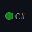
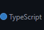
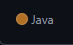
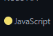

<!--
**Jhan10/Jhan10** is a ✨ _special_ ✨ repository because its `README.md` (this file) appears on your GitHub profile.

Here are some ideas to get you started:

- 🔭 I’m currently working on ...
- 🌱 I’m currently learning ...
- 👯 I’m looking to collaborate on ...
- 🤔 I’m looking for help with ...
- 💬 Ask me about ...
- 📫 How to reach me: ...
- 😄 Pronouns: ...
- ⚡ Fun fact: ...
-->

 <h3 align="center">Olá!</h3>

 <h2 align="center">Seja bem vindo ao meu repositório GitHub</h2>

 

Estes são os principais projetos:

| ClientsAPI | Discount Checkout | Acloptrad | Material Dashboard|
| --- | --- | --- | --- |
|  |  | | 
| <a href="">Testar</a> Em breve | <a href="">Testar</a> Em breve |<a href="">Testar</a> Em breve | <a href="">Testar</a> Em breve |

